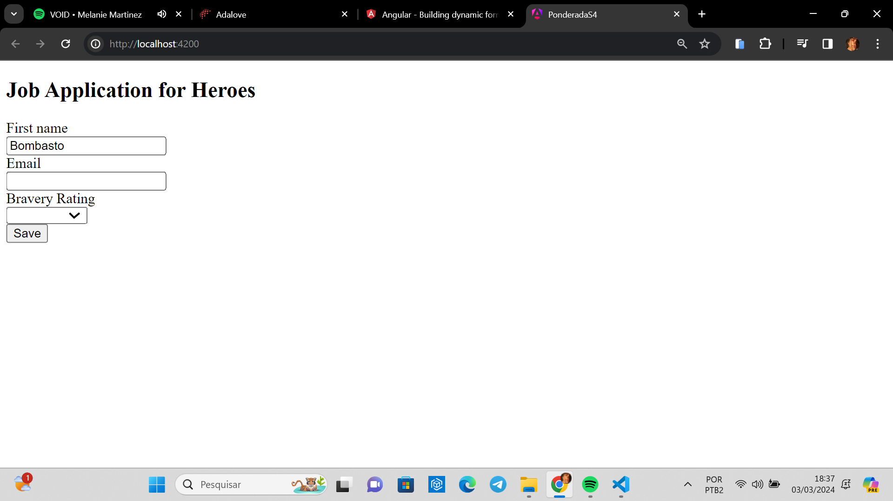
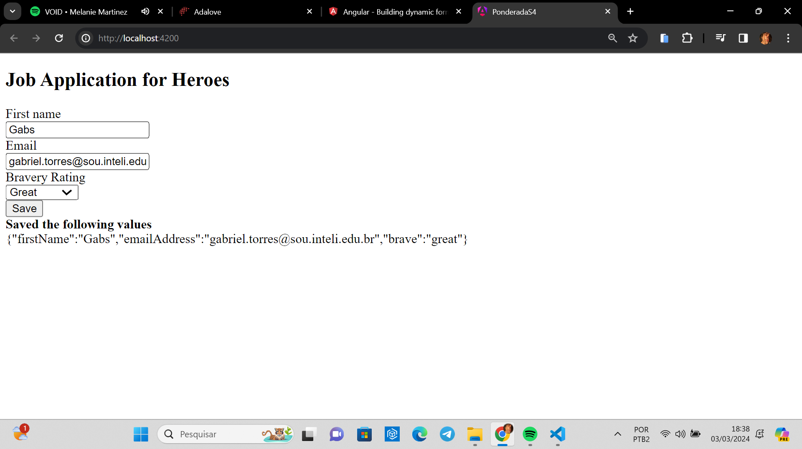

# Relatório sobre o Tutorial de Construção de Formulários Dinâmicos com Angular

## Introdução

O relatório dessa semana (4) tem como objetivo fornecer uma análise do tutorial sobre a construção de formulários dinâmicos com Angular.

## Conceitos Aprendidos

O tutorial ensina como criar formulários que podem se adaptar dinamicamente a diferentes cenários e requisitos. Isso é alcançado através do uso de metadados que descrevem o modelo do formulário.

Além disso, ele usa Reactive Forms do Angular, que é muito bom para lidar com fluxos de dados assíncronos e reagir a mudanças no estado da aplicação de forma eficiente. Também, é muito nítido como o Angular é uma estrutura baseada em componentes, e o tutorial demonstra como dividir a aplicação em componentes reutilizáveis e como modularizar o código. Assim, fica muito mais fácil seguir as melhores práticas de arquitetura de software.

Falando do formulário em si, ele usa o recurso de injeção de dependência do Angular para fornecer serviços e componentes em toda a aplicação de forma eficiente. Assim, ele aborda a validação de entrada de dados em formulários, garantindo que apenas dados válidos sejam aceitos.

## Conclusão

O tutorial de Construção de Formulários Dinâmicos com Angular fornece uma introdução abrangente aos conceitos e tecnologias essenciais para o desenvolvimento de aplicativos web modernos e mostra as melhores formas de criar um sistema com uma boa lógica e modularização.